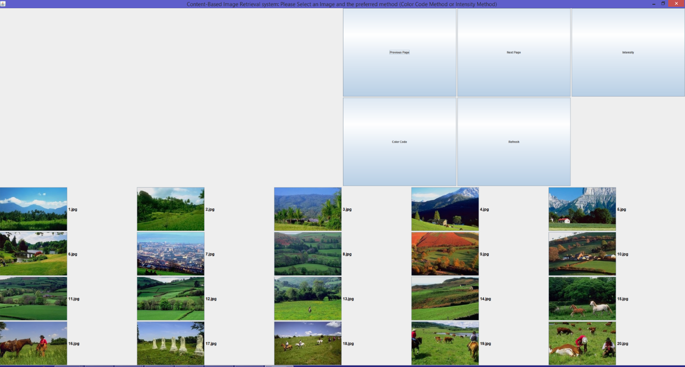
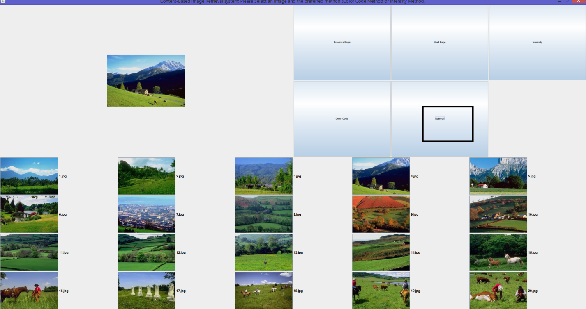

CSS 584 Assignment 1

Student Name: Ahmed Nada

**[How to run the program:]{.underline}**

1.  I'm attaching the whole project + package + src file
    (readImage.java + CBIR.java) + images folder

2.  Open the project in any Java Editor (I'm using NetBeans)

> {width="3.4583333333333335in" height="4.5in"}

3.  Once the project is opened, double click on the readImage.java file
    and build the project then click on run file (file here refers to
    the readImage.java file). After the readImage.java has been run,
    make sure the colorCode.txt and intensity.txt files were created.

> {width="6.493055555555555in"
> height="2.7569444444444446in"}

4.  After making sure that the colorCodes.txt and intensity.txt files
    were created. Proceed by running the project (if you were prompted
    which main to run, choose the main method in CBIR.java).

{width="5.729166666666667in"
height="3.6180555555555554in"}

5.  IF the project runs successfully, you should start seeing the main
    frame of the project as below

{width="6.5in" height="3.486111111111111in"}

6.  To navigate through the pictures. Click on the next Page button, to
    go back to the previous page click the previous page button.

7.  To start testing the system, click on the desired image and make
    sure it is displayed in the top panel.

{width="6.493055555555555in"
height="3.4444444444444446in"}

8.  If you want to check the intensity method results, please click on
    the intensity button. Or if you want to get the color code mechanism
    please click on the color code button

{width="6.5in" height="3.428472222222222in"}

9.  If you want to refresh the images to their original order, please
    click on refresh button. After clicking the refresh button, all
    images will be sorted with their original places sequentially so you
    can navigate through them sequentially.

{width="6.493055555555555in"
height="3.4305555555555554in"}

**[Query images for image 33:]{.underline}**

**Intensity Method:**

{width="6.652777777777778in"
height="3.5391043307086614in"}

**Color Code Method:**

{width="6.75in" height="3.5970811461067367in"}

**[Query images for image 93:]{.underline}**

**Intensity Method:**

{width="6.590277777777778in"
height="3.4997495625546806in"}

**Color Code Method:**

{width="6.604166666666667in"
height="3.516106736657918in"}

**Further analysis:**

The advantages of using the color code as a system designer is that it
allows us to classify the images based on its color code. The first 2
bits of each RGB value will mean that the most significant color
representation is considered. This makes the distance representation as
accurate enough to correlate the similarity and dissimilarity between 2
images being compared. As a user the color code obviously (and based on
results), gives better correlation of the images better than the
intensity histogram method. Another advantage is that color information
is faster to compute compared to other invariants. It was proven in some
cases that color can be an efficient method for identifying objects of
known location and appearance.

There are disadvantages of using the intensity histogram method since it
only uses the pixel intensity. Intensity histogram groups the similar
intensities into a histogram to represent an image which is not the best
way to represent an image since the values of RGB are given different
weights. In the assignment the Green color intensity for example was
given a higher weight because human eye is more sensitive to the green
color and is least sensitive to the blue color.

The limitation of both methods and using histograms in general to
represent the image is that the image is classified by relying heavily
on its colors. However, there are more attributes or features that can
be used in order to better classify an image, like the shape of the
object in the image being compared, as well as the texture of the
object. As we have seen, the color code histogram method has correlated
an image representing sunset with another image representing an orange
flower. Also, another limitation is that color histogram models are very
sensitive to noisy interference caused by intensity changes.

There have been some solutions introduced to address the drawbacks
caused by intensity and color code histograms like color histogram
intersection, color constant indexing, cumulative color histogram,
quadratic distance, and color correlograms.

Also, some papers are talking about over coming the color and intensity
histogram models by using the textual tags associated with the image and
comparing the metadata for image comparison. This might be a good
solution and used by major websites including Google, YouTube and
Facebook, however, this methodology relies on human intervention to
interpret image content and to produce tags associated with the image
\[1\].

In addition to the above methods, utilizing shape information for
automated image comparisons requires algorithms that perform some form
of edge detection or image segmentation. Segmentation refers to the
identification of the major color regions in an image. These regions can
then be compared from one image to the next. Edge detection tends to be
slightly more complicated as it attempts to identify the major contours
and edges in each image \[2\].

**[References:]{.underline}**

\[1\] Chakravarti, Rishav & Meng, Xiannong. (2009). A Study of Color
Histogram Based Image Retrieval. 1323 - 1328. 10.1109/ITNG.2009.126.

\[2\] Smith, John R, and Shi-Fu Chang. "Tools and Techniques for Color
Retrieval." Electronic Imaging: Science and Technology-Storage\~
Retrieval for Image and Video Database IV. San Jose: IS&T/SPIE, 1996.
1-12.
